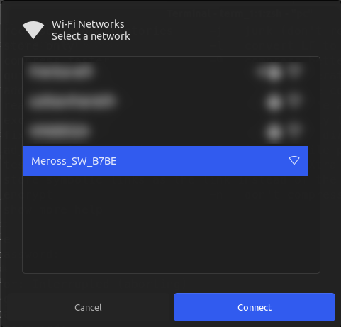

<!-- TABLE OF CONTENTS -->
## Table of Contents

- [Table of Contents](#table-of-contents)
- [About The Project](#about-the-project)
- [Provisioning](#provisioning)
  - [Wifi Provisioning](#wifi-provisioning)
    - [Usage](#usage)
  - [Bluetooth provisioning](#bluetooth-provisioning)
    - [Usage](#usage-1)
- [Communication](#communication)
  - [Usage](#usage-2)
    - [GET Example](#get-example)
    - [SET Example](#set-example)
- [MQTT server setup (optional)](#mqtt-server-setup-optional)
- [Acknowledgements](#acknowledgements)

<!-- ABOUT THE PROJECT -->
## About The Project

The point of this repository is to document and provide tooling to onboard meross devices without having to interact with meross cloud or use the meross phone application.

This was originally a fork of arandalls [repository](https://github.com/arandall/meross), who did some amazing work documenting the protocol but which is no longer receiving updates.

## Provisioning

There are two types of meross device provisioning, Wifi and Bluetooth.

Devices that leverage Wifi provisioning will advertise a temporary Wifi network. A client is expected to connect to this network and configure the device.

Devices that leverage Bluetooth provisioning will advertise as a Bluetooth low energy (BLE) peripheral. A client is expected to connect to the peripheral via bluetooth and configure it.

This repository contains tooling for on-boarding to both device types.

### Wifi Provisioning

`merossWifi.sh` is a shell script that facilitates onboarding devices that leverage Wifi provisioning.

#### Usage

>Reset the meross device to make it enter configuration mode.

>Connect to its temporary Wifi network:



>Query the device for the list of network devices that it can see:

```bash
tools/merossWifi.sh --wifi
```

<details>
  <summary>Output</summary>

```bash
❯ tools/merossWifi.sh --wifi
Wifi scan initiated (takes around 10 seconds)...
  % Total    % Received % Xferd  Average Speed   Time    Time     Time  Current
                                 Dload  Upload   Total   Spent    Left  Speed
100   865    0   625  100   240    204     78  0:00:03  0:00:03 --:--:--   282
{
  "ssid": "some-network",
  "bssid": "11:22:33:44:55:66",
  "channel": 11,
  "encryption": 8,
  "cipher": 4,
  "signal strength": 86
}
{
  "ssid": "XXXXXX",
  "bssid": "XXXXXX",
  "channel": 1,
  "encryption": 6,
  "cipher": 3,
  "signal strength": 70
}
{
  "ssid": "XXXXXX",
  "bssid": "XXXXXX",
  "channel": 6,
  "encryption": 6,
  "cipher": 3,
  "signal strength": 42
}
```
</details>

>Onboard the device to the desired network:

```bash
tools/merossWifi.sh --ssid "some-network" --password "some-password" --bssid "11:22:33:44:55:66" --channel "11" --encryption "8" --cipher "4"
```

<details>
  <summary>Output</summary>

```bash
❯ tools/merossWifi.sh --ssid "some-network" --password "some-password" --bssid "11:22:33:44:55:66" --channel "11" --encryption "8" --cipher "4"
  % Total    % Received % Xferd  Average Speed   Time    Time     Time  Current
                                 Dload  Upload   Total   Spent    Left  Speed
100   586    0   280  100   306   6086   6652 --:--:-- --:--:-- --:--:-- 12739
{"header":{"messageId":"e9fd0577e42915dd7759c4d9e62e7570","namespace":"Appliance.Config.Key","method":"SETACK","payloadVersion":1,"from":"/appliance/2104122375317590849148e1e96bb7be/publish","timestamp":25,"timestampMs":100,"sign":"847c0bb5fc4c1bdc5e1645fa8b20ac79"},"payload":{}}
Key configured
  % Total    % Received % Xferd  Average Speed   Time    Time     Time  Current
                                 Dload  Upload   Total   Spent    Left  Speed
100   660    0   281  100   379   4606   6213 --:--:-- --:--:-- --:--:-- 10819
{"header":{"messageId":"5508acc5e917b65b495525864a597745","namespace":"Appliance.Config.Wifi","method":"SETACK","payloadVersion":1,"from":"/appliance/2104122375317590849148e1e96bb7be/publish","timestamp":25,"timestampMs":244,"sign":"66131a5988999b7538a8fcb359136e3b"},"payload":{}}
Wifi configured
```
</details>

### Bluetooth provisioning

`merossBLE.py` is a python script that facilitates onboarding devices that leverage Bluetooth provisioning.

#### Usage

>Reset the meross device to make it enter configuration mode.

>Scan for in-range meross bluetooth peripherals:

```bash
tools/merossBLE.py scan
```

<details>
  <summary>Output</summary>

```bash
❯ tools/merossBLE.py scan
DB:E9:10:EB:E0:B8
```
</details>

>Query the device for the list of network devices that it can see:

```bash
tools/merossBLE.py wifi_scan --mac-address DB:E9:10:EB:E0:B8 | jq
```
<details>
  <summary>Output</summary>

```bash
❯ tools/merossBLE.py wifi_scan --mac-address DB:E9:10:EB:E0:B8 | jq
[
  {
    "ssid": "some-network",
    "bssid": "11:22:33:44:55:66",
    "channel": 11,
    "encryption": 8,
    "cipher": 4,
    "signal strength": 86
  }
  {
    "ssid": "XXXXXX",
    "bssid": "XXXXXX",
    "channel": 1,
    "encryption": 6,
    "cipher": 3,
    "signal strength": 70
  }
  {
    "ssid": "XXXXXX",
    "bssid": "XXXXXX",
    "channel": 6,
    "encryption": 6,
    "cipher": 3,
    "signal strength": 42
  }
]

```
</details>

>Onboard the device to the desired network:

```bash
tools/merossBLE.py onboard --mac-address DB:E9:10:EB:E0:B8 --key "some-key" --ssid "some-network" --password "some-password" --bssid "11:22:33:44:55:66" --channel "11" --encryption "8" --cipher "4"
```

<details>
  <summary>Output</summary>

```bash
❯ tools/merossBLE.py onboard --mac-address DB:E9:10:EB:E0:B8 --key "some-key" --ssid "some-network" --password "some-password" --bssid "11:22:33:44:55:66" --channel "11" --encryption "8" --cipher "4"
{"header":{"messageId":"e05321b068ef124eb9c452f6275743b8","namespace":"Appliance.System.Hardware","method":"GETACK","payloadVersion":1,"from":"/appliance/2308283569760958070148e1e9d7c243/publish","uuid":"2308283569760958070148e1e9d7c243","timestamp":483,"timestampMs":164,"sign":"59ab7935df87780463077206c340eaf0"},"payload":{"hardware":{"type":"mss710","subType":"un","version":"8.0.0","chipType":"rtl8720cf","uuid":"2308283569760958070148e1e9d7c243","macAddress":"48:e1:e9:d7:c2:43"}}}
{"header":{"messageId":"3f3eee82e2a8b74cf59f95577b0677ce","namespace":"Appliance.Config.Key","method":"SETACK","payloadVersion":1,"from":"/appliance/2308283569760958070148e1e9d7c243/publish","uuid":"2308283569760958070148e1e9d7c243","timestamp":483,"timestampMs":963,"sign":"64152844d47128c775aa8ec5e4cfb3c3"},"payload":{}}
{"header":{"messageId":"bd5972dd27b11bd118b1d150ab643eea","namespace":"Appliance.Config.WifiX","method":"SETACK","payloadVersion":1,"from":"/appliance/2308283569760958070148e1e9d7c243/publish","uuid":"2308283569760958070148e1e9d7c243","timestamp":484,"timestampMs":683,"sign":"b2e71494966d7aefc719f33427c6cbbd"},"payload":{}}
```

</details>

## Communication

Meross devices have a HTTP "side channel" that allows HTTP calls to be made directly to the device via the network. This is used in the meross app when on the same local network as its faster than going via the cloud.

`merossCurl.sh` is a shell script that leverages this ability to send arbitrary curl calls to meross devices.

### Usage

>Interaction with meross devices is achieved by using 'Abilities'. A given device will have many such abilities that can be queried to read or change device state. A full list of abilities and payloads is available under [protocol.md](./doc/protocol.md)

#### GET Example

`Appliance.System.Ability` can be used to print all available abilities for a given device:

```bash
tools/merossCurl.sh 192.168.1.140 GET Appliance.System.Ability '' '' | jq
```

<details>
  <summary>Output</summary>

```bash
❯ tools/merossCurl.sh 192.168.1.140 GET Appliance.System.Ability '' '' | jq
  % Total    % Received % Xferd  Average Speed   Time    Time     Time  Current
                                 Dload  Upload   Total   Spent    Left  Speed
100  1343    0  1104  100   239  55200  11950 --:--:-- --:--:-- --:--:-- 67150
{
  "header": {
    "messageId": "d1841504631b908ec3f222142f081931",
    "namespace": "Appliance.System.Ability",
    "method": "GETACK",
    "payloadVersion": 1,
    "from": "/appliance/2102259955984090842748e1e94e0605/publish",
    "timestamp": 1730738038,
    "timestampMs": 34,
    "sign": "aae7963ad8207f0d8317cb02d9ea8e72"
  },
  "payload": {
    "payloadVersion": 1,
    "ability": {
      "Appliance.Config.Key": {},
      "Appliance.Config.WifiList": {},
      "Appliance.Config.Wifi": {},
      "Appliance.Config.Trace": {},
      "Appliance.System.All": {},
      "Appliance.System.Hardware": {},
      "Appliance.System.Firmware": {},
      "Appliance.System.Debug": {},
      "Appliance.System.Online": {},
      "Appliance.System.Time": {},
      "Appliance.System.Ability": {},
      "Appliance.System.Runtime": {},
      "Appliance.System.Report": {},
      "Appliance.System.Position": {},
      "Appliance.System.Factory": {},
      "Appliance.Control.Multiple": {
        "maxCmdNum": 5
      },
      "Appliance.Control.ToggleX": {},
      "Appliance.Control.TimerX": {
        "sunOffsetSupport": 1
      },
      "Appliance.Control.TriggerX": {},
      "Appliance.Control.Bind": {},
      "Appliance.Control.Unbind": {},
      "Appliance.Control.Upgrade": {},
      "Appliance.Control.Light": {
        "capacity": 7
      },
      "Appliance.Digest.TriggerX": {},
      "Appliance.Digest.TimerX": {}
    }
  }
}
```

</details>
Where positional args are as follows:

| Index | Name  | Value | Description|
|-------|------ |-------|------------|
| 0     | IP_ADDR | 192.168.1.140| Ip address of the meross device |
| 1     | METHOD  | GET | Whether to GET or SET someting on the device|
| 2     | ABILITY | Appliance.System.Ability | The specific ability to GET or SET |
| 3     | KEY     | "" | Key, which was set during onboarding, a key was not configured in this instance so left blank |
| 4     | JSON    | "" | The JSON payload to send to the ability, usually left blank when using GET |
 


#### SET Example

`Appliance.Control.ToggleX` can be used to control the on/off state of most meross devices, for example to turn a meross device on:

```bash
tools/merossCurl.sh 192.168.1.140 SET Appliance.Control.ToggleX '' '{"togglex":{"channel": 0, "onoff":1}}' | jq
```

<details>
  <summary>Output</summary>

```bash
❯ tools/merossCurl.sh 192.168.1.140 SET Appliance.Control.ToggleX '' '{"togglex":{"channel": 0, "onoff":1}}' | jq
  % Total    % Received % Xferd  Average Speed   Time    Time     Time  Current
                                 Dload  Upload   Total   Spent    Left  Speed
100   565    0   294  100   271   3542   3265 --:--:-- --:--:-- --:--:--  6807
{
  "header": {
    "messageId": "308a1f33c176c610f71ab18a60d8bbe5",
    "namespace": "Appliance.Control.ToggleX",
    "method": "SETACK",
    "payloadVersion": 1,
    "from": "/appliance/2102259955984090842748e1e94e0605/publish",
    "timestamp": 1730738751,
    "timestampMs": 597,
    "sign": "4d2282cfd55c512792208687f6d480f1"
  },
  "payload": {}
}
```

</details>


Where positional args are as follows:

| Index | Name  | Value | Description|
|-------|------ |-------|------------|
| 0     | IP_ADDR | 192.168.1.140| Ip address of the meross device |
| 1     | METHOD  | SET | Whether to GET or SET someting on the device|
| 2     | ABILITY | Appliance.Control.ToggleX | The specific ability to GET or SET |
| 3     | KEY     | "" | Key, which was set during onboarding, a key was not configured in this instance so left blank |
| 4     | JSON    | "{"togglex":{"channel": 0, "onoff":1}}" | The JSON payload to send to the ability |


## [MQTT server setup (optional)](./MQTT.md)


<!-- ACKNOWLEDGEMENTS -->
## Acknowledgements

Thanks to the following project that got me off to a good start.

* https://github.com/bapirex/meross-api for providing details for `meross-cloud` to obtain existing device keys.
* https://github.com/mrgsts/mss310-kontrol for showing the JSON API details.
* https://github.com/arandall/meross for extensive documentation on API
* https://github.com/bytespider/Meross/ for the mosquitto setup steps
* https://github.com/Fabi019/MerossBLE for reference implementation of Bluetooth code
